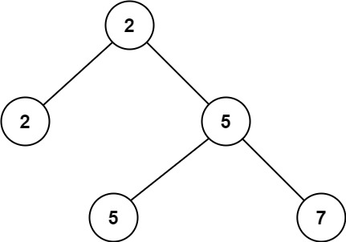

#### [671. 二叉树中第二小的节点](https://leetcode-cn.com/problems/second-minimum-node-in-a-binary-tree/)

给定一个非空特殊的二叉树，每个节点都是正数，并且每个节点的子节点数量只能为 `2` 或 `0`。如果一个节点有两个子节点的话，那么该节点的值等于两个子节点中较小的一个。

更正式地说，`root.val = min(root.left.val, root.right.val)` 总成立。

给出这样的一个二叉树，你需要输出所有节点中的**第二小的值。**如果第二小的值不存在的话，输出 -1 **。**

 

**示例 1：**



```
输入：root = [2,2,5,null,null,5,7]
输出：5
解释：最小的值是 2 ，第二小的值是 5 。
```

**示例 2：**


```
输入：root = [2,2,2]
输出：-1
解释：最小的值是 2, 但是不存在第二小的值。
```

 

**提示：**

- 树中节点数目在范围 `[1, 25]` 内
- `1 <= Node.val <= 231 - 1`
- 对于树中每个节点 `root.val == min(root.left.val, root.right.val)`

```python
class Solution:
    '''根节点一定是最小的，只要找出严格比根节点大的就行
    '''
    def findSecondMinimumValue(self, root: TreeNode) -> int:
        ans, rootvalue = -1, root.val
        def dfs(node: TreeNode) -> None:
            nonlocal ans
            if not node:
                return
            if ans != -1 and node.val >= ans: # 已经找到直接返回
                return
            if node.val > rootvalue: # 找到
                ans = node.val   
            dfs(node.left)
            dfs(node.right)
        dfs(root)
        return ans
# 作者：LeetCode-Solution
# 链接：https://leetcode-cn.com/problems/second-minimum-node-in-a-binary-tree/solution/er-cha-shu-zhong-di-er-xiao-de-jie-dian-bhxiw/
# 来源：力扣（LeetCode）
# 著作权归作者所有。商业转载请联系作者获得授权，非商业转载请注明出处。
```

